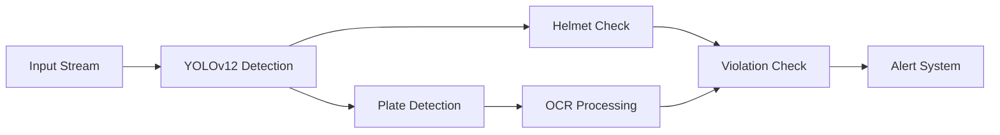

<div align="center">

# 🚦 Intelligent Traffic Violation Detection System

[](https://www.python.org/)
[](https://github.com/ultralytics/yolov5)
[](LICENSE)
[](CONTRIBUTING.md)

### AI-Powered Traffic Monitoring & Violation Detection

<p align="center">
  
</p>

[Demo Video](https://youtu.be/YOUR-DEMO-LINK) | [Documentation](#documentation) | [Installation](#-installation) | [Quick Start](#-quick-start)

</div>

---

## 🎯 Key Features

<div align="center">

| 🔍 Detection | 🎓 Recognition | 💫 Special |
|------------|--------------|-----------|
| Helmetless Riding | License Plate OCR | Real-time Processing |
| Multiple Riders | Vehicle Type | Night Vision Support |
| Traffic Violations | Speed Detection | Multi-Camera Ready |

</div>

## 🚀 Quick Start

```bash
# Clone & Install
git clone https://github.com/ckarthik77/License-Plate-Recognition-Integrating-No-Helmet-Detection.git
cd License-Plate-Recognition-Integrating-No-Helmet-Detection

# Setup Environment
conda create -n yolov12 python=3.11
conda activate yolov12
pip install -r requirements.txt

# Launch App
python yolov12/app.py
```

## 📊 Performance Metrics

<div align="center">

| Task | Accuracy | FPS | GPU Memory |
|------|----------|-----|------------|
| Helmet Detection | 93% | 30 | 2.1 GB |
| Plate Recognition | 91% | 25 | 1.8 GB |
| Combined Pipeline | 88% | 20 | 3.2 GB |

</div>

## 🎥 Demo & Examples

<div align="center">
<table>
<tr>
  <td></td>
  <td></td>
  <td></td>
</tr>
<tr>
  <td>Helmet Detection</td>
  <td>License Plate Recognition</td>
  <td>Night Vision Mode</td>
</tr>
</table>
</div>

## 🛠️ Technical Architecture



## 📈 Features & Capabilities

- **Advanced Detection**
  - 🎯 Real-time object detection using YOLOv12
  - 🔍 Multi-object tracking
  - 🌙 Low-light enhancement

- **Smart Recognition**
  - 📝 Automatic license plate reading
  - 👥 Rider count detection
  - 🏍️ Vehicle classification

- **System Features**
  - ⚡ GPU-accelerated processing
  - 📊 Real-time statistics
  - 💾 Automated logging

## 🔧 Configuration

```yaml
model:
  confidence: 0.5
  img_size: 640
  device: cuda

detection:
  helmet_conf: 0.45
  plate_conf: 0.40
  max_det: 100

system:
  gpu_enabled: true
  batch_size: 16
  workers: 4
```

## 🌟 Contributing

We welcome contributions! See our [Contributing Guide](CONTRIBUTING.md) for details.

<div align="center">

### Made with ❤️ by [Your Team/Organization]

[Report Bug](https://github.com/ckarthik77/License-Plate-Recognition-Integrating-No-Helmet-Detection/issues) · [Request Feature](https://github.com/ckarthik77/License-Plate-Recognition-Integrating-No-Helmet-Detection/issues)

</div>