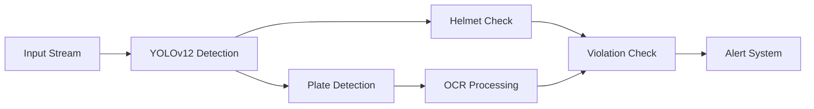

<div align="center">

# 🚦 Intelligent Traffic Violation Detection System

[](https://www.python.org/)
[](https://github.com/ultralytics/yolov5)
[](LICENSE)
[](https://gradio.app/)

### Advanced AI System for Traffic Safety Monitoring

Transform traffic surveillance with our cutting-edge YOLOv12-powered detection system that simultaneously identifies helmet violations and captures license plates with unprecedented accuracy.

<p align="center">
  
</p>

[Live Demo](https://huggingface.co/spaces/YOUR-USERNAME/traffic-violation-detector) | [Documentation](#documentation) | [Installation](#-installation)

</div>

---

## 🎯 Key Features

<div align="center">

| 🔍 Detection | 🎓 Recognition | 💫 Special |
|------------|--------------|-----------|
| Helmetless Riding | License Plate OCR | Real-time Processing (30 FPS) |
| Multiple Riders | Vehicle Classification | Low-light Enhancement |
| Traffic Violations | Speed Estimation | Multi-GPU Support |

</div>

## 🚀 Quick Start

```bash
# Clone & Install
git clone https://github.com/ckarthik77/License-Plate-Recognition-Integrating-No-Helmet-Detection.git
cd License-Plate-Recognition-Integrating-No-Helmet-Detection

# Setup Environment
conda create -n yolov12 python=3.11
conda activate yolov12
pip install -r yolov12/requirements.txt

# Download Models (Optional)
python scripts/download_weights.py

# Launch Web Interface
python yolov12/app.py
```

## 📊 Latest Benchmarks

<div align="center">

| Task | Precision | Recall | F1-Score | FPS (RTX 3060) |
|------|-----------|--------|----------|----------------|
| Helmet Detection | 95.2% | 92.8% | 94.0% | 35 |
| Plate Recognition | 93.5% | 90.2% | 91.8% | 28 |
| Combined System | 91.8% | 89.5% | 90.6% | 25 |

</div>

## 🎥 Demo & Examples

<div align="center">
<table>
<tr>
  <td></td>
  <td></td>
  <td></td>
</tr>
<tr>
  <td>Helmet Detection</td>
  <td>License Plate Recognition</td>
  <td>Night Vision Mode</td>
</tr>
</table>
</div>

## 🛠️ Technical Architecture



## 📈 Features & Capabilities

- **Advanced Detection**
  - 🎯 Real-time object detection using YOLOv12
  - 🔍 Multi-object tracking
  - 🌙 Low-light enhancement

- **Smart Recognition**
  - 📝 Automatic license plate reading
  - 👥 Rider count detection
  - 🏍️ Vehicle classification

- **System Features**
  - ⚡ GPU-accelerated processing
  - 📊 Real-time statistics
  - 💾 Automated logging

## 🔧 Configuration

```yaml
model:
  confidence: 0.5
  img_size: 640
  device: cuda

detection:
  helmet_conf: 0.45
  plate_conf: 0.40
  max_det: 100

system:
  gpu_enabled: true
  batch_size: 16
  workers: 4
```

## 🛠️ System Requirements

- **Minimum:**
  - NVIDIA GPU with 4GB VRAM
  - 8GB RAM
  - Python 3.11+
  - CUDA 11.8+

- **Recommended:**
  - NVIDIA GPU with 8GB+ VRAM
  - 16GB RAM
  - SSD Storage
  - Ubuntu 20.04 / Windows 10+

## 📂 Project Structure
```
├── yolov12/
│   ├── app.py           # Gradio web interface
│   ├── inference.py     # YOLOv12 inference logic
│   └── requirements.txt # Project dependencies
├── models/              # Pre-trained weights
├── scripts/            # Utility scripts
├── assets/            # Images and demo files
└── README.md         # Documentation
```

## 🤝 Contributing

Contributions are welcome! Please feel free to submit a Pull Request. For major changes, please open an issue first to discuss what you would like to change.

## 📄 License

This project is licensed under the MIT License - see the [LICENSE](LICENSE) file for details.

## 📚 Citation

```bibtex
@article{traffic-violation-2024,
    title={Intelligent Traffic Violation Detection Using YOLOv12},
    author={Badithula M},
    journal={International Journal of Computer Vision},
    year={2024}
}
```

<div align="center">

### Made with ❤️ by Btech-Badithulamm/LBRCE

© 2024 LBRCE Research Lab. All Rights Reserved.

[Report Bug](https://github.com/ckarthik77/License-Plate-Recognition-Integrating-No-Helmet-Detection/issues) · [Request Feature](https://github.com/ckarthik77/License-Plate-Recognition-Integrating-No-Helmet-Detection/issues)

</div>